# Go HTTP Server - Architecture Diagrams

This document contains comprehensive Mermaid diagrams illustrating the architecture and workflows of the Go HTTP Server project.

## 1. System Architecture

## 2. API Endpoints Flow

```mermaid
graph LR
    Client[Client] --> Router{HTTP Router}
    
    Router -->|GET /| Home[Home Handler<br/>Welcome Message]
    Router -->|GET /health| Health[Health Handler<br/>Status & Uptime]
    Router -->|GET /api/info| Info[Info Handler<br/>Server Info]
    Router -->|GET /api/echo| Echo[Echo Handler<br/>Message Echo]
    Router -->|POST /api/data| Data[Data Handler<br/>JSON Processing]
    
    Home --> MW1[CORS Middleware]
    Health --> MW2[CORS Middleware]
    Info --> MW3[CORS Middleware]
    Echo --> MW4[CORS Middleware]
    Data --> MW5[CORS Middleware]
    
    MW1 --> Log1[Logging Middleware]
    MW2 --> Log2[Logging Middleware]
    MW3 --> Log3[Logging Middleware]
    MW4 --> Log4[Logging Middleware]
    MW5 --> Log5[Logging Middleware]
    
    Log1 --> Resp1[JSON Response]
    Log2 --> Resp2[JSON Response]
    Log3 --> Resp3[JSON Response]
    Log4 --> Resp4[JSON Response]
    Log5 --> Resp5[JSON Response]
    
    style Router fill:#fff4e1
    style Home fill:#e8f5e9
    style Health fill:#e8f5e9
    style Info fill:#e8f5e9
    style Echo fill:#e8f5e9
    style Data fill:#e8f5e9
```

## 3. Deployment Workflow

## 4. Request Processing Flow

## 5. Docker Multi-Stage Build

## 6. Application Lifecycle

## Diagram Descriptions

### 1. System Architecture
Shows the complete deployment structure with Kubernetes components including the Service (NodePort), Deployment with 2 replicas, and the containerized Go application with health checks.

### 2. API Endpoints Flow
Illustrates how HTTP requests are routed to different handlers and processed through CORS and logging middleware layers.

### 3. Deployment Workflow
Sequence diagram showing the step-by-step process of building the Docker image and deploying to Kubernetes via Minikube.

### 4. Request Processing Flow
Detailed flowchart of how each HTTP request is processed, including validation, error handling, and response generation.

### 5. Docker Multi-Stage Build
Demonstrates the two-stage Docker build process that creates a minimal production image (~15MB).

### 6. Application Lifecycle
State diagram showing the server's lifecycle from startup through request processing to graceful shutdown.

---

**Generated for:** Go HTTP Server v1.0.0  
**Date:** 2025-12-14  
**Author:** Bob
